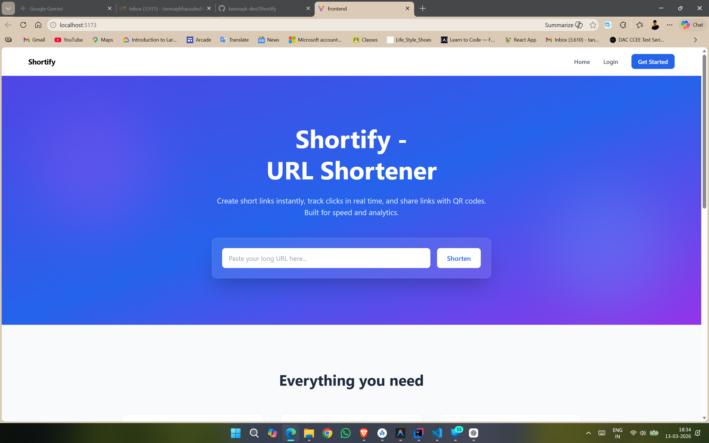
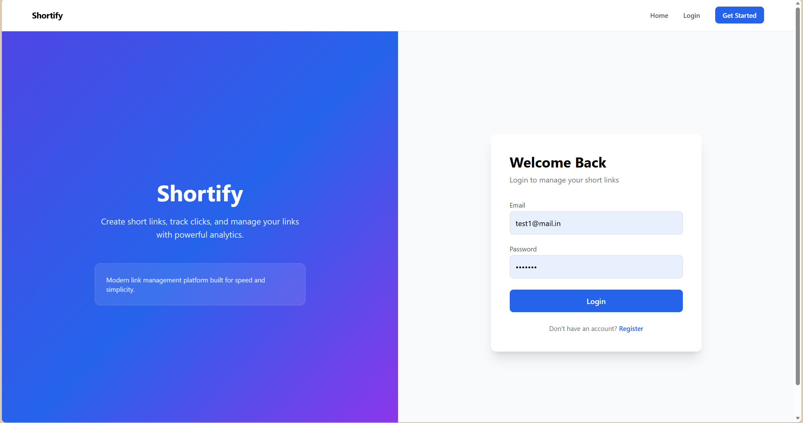
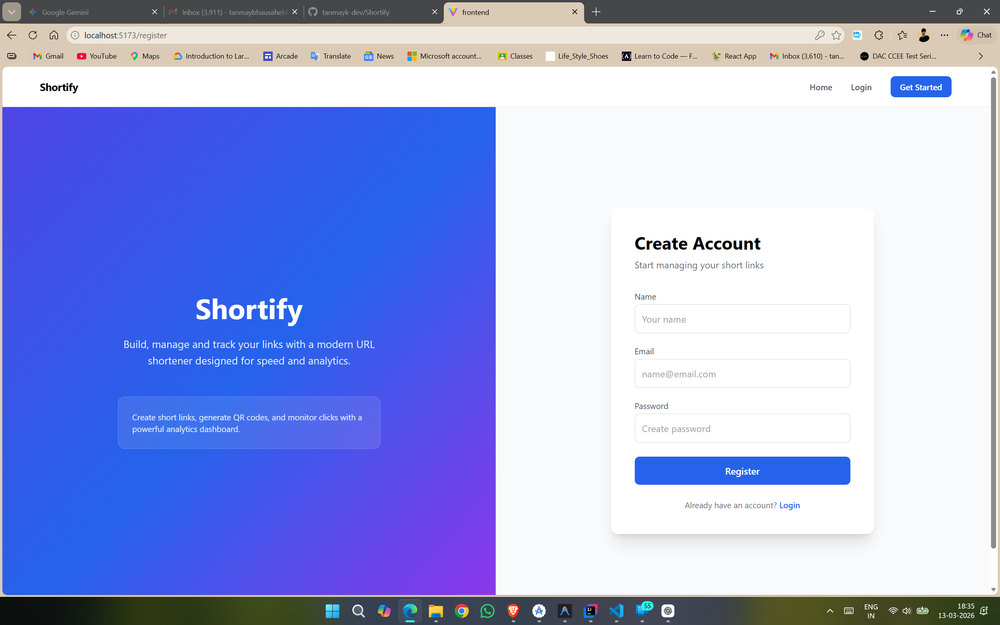
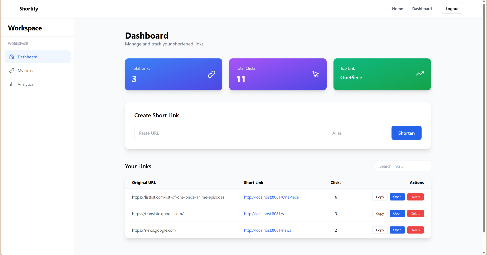
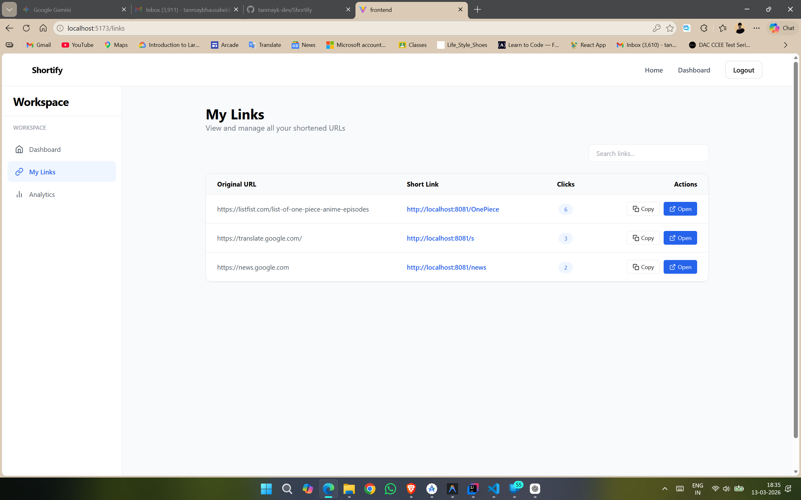
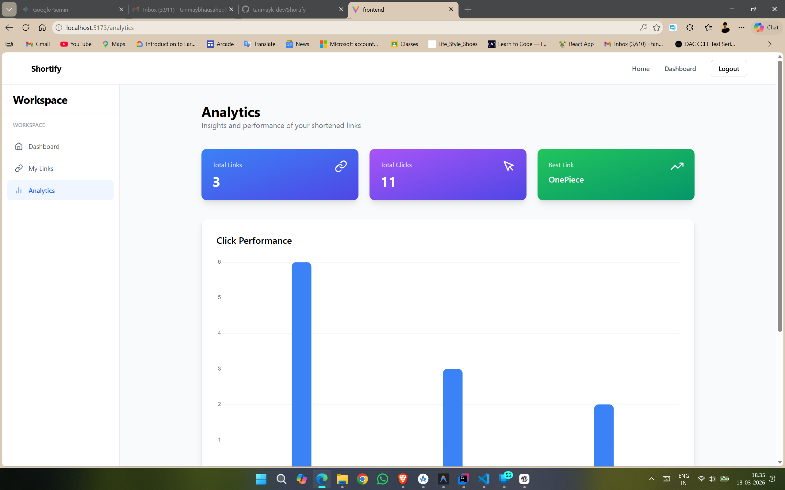
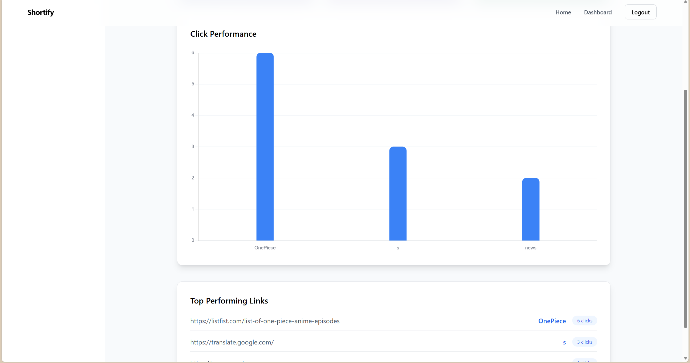

# Shortify 🔗

<p align="center">
  
</p>

<p align="center">
A modern full‑stack **URL Shortener SaaS platform** built with React,
Spring Boot, and MySQL.
</p>

Shortify allows users to create short links, manage them through a
dashboard, and analyze link performance using a clean analytics
interface.

------------------------------------------------------------------------

# 🚀 Features

## 🔗 URL Shortening

-   Generate short links instantly
-   Custom alias support
-   Copy links to clipboard
-   QR code generation

## 📊 Analytics

-   Click tracking
-   Link performance chart
-   Most popular links insight

## 📁 Link Management

-   View all created links
-   Search links instantly
-   Delete links
-   Open shortened links

## 🔐 Authentication

-   User registration
-   Secure login
-   JWT authentication
-   Protected routes

## 🎨 Modern UI

-   Responsive SaaS‑style dashboard
-   Mobile‑friendly layout
-   Interactive UI components

------------------------------------------------------------------------

# 🛠 Tech Stack

### Frontend

-   React
-   Vite
-   Tailwind CSS
-   React Router
-   Chart.js
-   React Icons

### Backend

-   Java
-   Spring Boot
-   REST API
-   JWT Authentication

### Database

-   MySQL
-   Hibernate / JPA

------------------------------------------------------------------------

# 🏗 System Architecture

Frontend (React + Vite) ↓ REST API Backend (Spring Boot) ↓ JPA /
Hibernate Database (MySQL)

------------------------------------------------------------------------

# 📂 Project Structure

```
shortify 
├── frontend/   #React+ Vite frontend 
├── backend/    #Spring Boot backend
├── screenshots 
│ ├── analytics1.png
│ ├── analytics2.png 
│ ├── dashboard.png 
│ ├── landing_page.png 
│ ├──login.png 
│ ├── mylinks.png 
│ └── register.png 
├── README.md
```
------------------------------------------------------------------------

# 🖼 Application Screenshots

## Landing Page


## Login Page



## Register Page



## Dashboard



## My Links



## Analytics





------------------------------------------------------------------------

# ⚙️ Installation

## Clone Repository

```
git clone https://github.com/YOUR_USERNAME/Shortify.git 
cd Shortify
```

------------------------------------------------------------------------

## Backend Setup

```
cd backend
```

Configure database inside:

application.properties

Example:

spring.datasource.url=jdbc:mysql://localhost:3306/shortify
spring.datasource.username=root spring.datasource.password=yourpassword

Run backend:

```
mvn spring-boot:run
```

------------------------------------------------------------------------

## Frontend Setup

```
cd frontend 

npm install 

npm run dev

```
Frontend runs at:

http://localhost:5173

------------------------------------------------------------------------

# 📊 Future Improvements

-   Dark mode
-   Custom domains
-   Expiring links
-   Advanced analytics
-   Cloud deployment

------------------------------------------------------------------------

# 💼 Resume Description

Developed a full‑stack URL shortener platform using React, Spring Boot,
and MySQL enabling users to generate custom short links, track click
analytics, and manage URLs through a responsive dashboard with
authentication and data visualization.

------------------------------------------------------------------------

# 👨‍💻 Author

Tanmay Kaldate

GitHub: https://github.com/tanmay-kaldate-26
